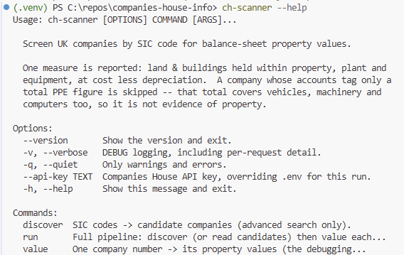

# Companies House Property Value Scanner

Companies House Property Value Scanner is a command-line tool I built for a friend who was trying to determine quickly at scale: which UK companies in a given industry own property, and what is it worth on their books? 
You give it one or more SIC codes; it finds every active company carrying those codes on the Companies House register, locates each one's most recent annual accounts, parses the machine-readable iXBRL filing, and extracts the balance-sheet carrying value of land and buildings held within property, plant and equipment — for both the current and prior year — into a CSV built for human review. 

The stack is intentionally straightforward as I just wanted to get it working: Python 3.11+, click for the CLI, requests for HTTP, lxml for XML parsing, PyYAML for configuration and python-dotenv for secrets, with pytest for a test suite 

It talks to two Companies House APIs — the main REST API and the separate document API — and handles their quirks directly: the API key is the HTTP Basic auth username with an empty password, and fetching an accounts document is a two-request dance where /content returns a 302 to a short-lived pre-signed S3 URL that must then be fetched without the Companies House Authorization header, because S3 rejects a request carrying two auth mechanisms. All HTTP is confined to a single module; nothing else in the codebase is permitted to import requests. Distribution is a frozen single-folder PyInstaller build produced by a GitHub Actions workflow on a windows-latest runner (PyInstaller bundles the interpreter it runs under, so cross-compilation is impossible), with a PowerShell build script that tests, freezes, smoke-tests and zips, and attaches the artifact to any v* tag's release.

The most interesting design decisions came from measuring real data rather than reasoning from the taxonomy documentation. Before a single line of matching logic was written, 100 real filings were parsed to build the tag map — and the findings reshaped the implementation. A substring match on PropertyPlantEquipment reads the wrong number, because filings also tag PropertyPlantEquipmentGrossCost and AccumulatedDepreciationImpairmentPropertyPlantEquipment; for one sampled company that is £140.7m of gross cost against a £35.2m carrying value. Namespace prefixes turned out to be meaningless — the same concept appears as core:, uk-core:, frs-core: and, in one filing whose generator numbers its namespaces, ns5: — so every QName is resolved through the element's own namespace map and matched on local name. Scale is not decoration: 205 of 684 sampled numeric facts carried scale="3" (accounts stated in £'000), so ignoring it is silently wrong by a factor of a thousand on a third of the numbers. And "land and buildings" is not a concept at all but a dimension member on a PPE fact, which can carry a second axis simultaneously — a rule demanding it be the only dimension quietly drops those companies while the row still looks healthy.

A recurring principle runs through the codebase: missing is fine, wrong is not. Where a figure cannot be determined safely, the tool declines rather than guesses, and says so loudly. Group accounts are skipped outright — the consolidation axis means parent-only figures are undimensioned, so a naive extractor preferring undimensioned facts returns the holding company alone (one sampled filing tags £2,304,315 consolidated against £5,000 parent-only). A growth percentage whose prior year is zero, negative or missing is left blank, never zero, because zero reads as "the property did not move" — a different and false claim. A blank cell means the filing did not tag the figure; a 0 means it tagged a zero, which is the genuinely interesting case of a company that sold its only property. Confidence is a deliberately blunt score out of 100 from a fixed four-entry deduction table, and the docs are honest that its floor is therefore 60, that the default threshold of 60 consequently filters nothing, and that a large year-on-year movement is flagged but never scored down — because at historic cost less depreciation, a big move is a real event, not a misread number. Every skip is a structured outcome with a stage, a closed-set reason code and a detail string, and the end-of-run summary leads with the reason-code histogram, since that is the diagnostic you actually tune the config from.

Because the Companies House quota is 600 requests per rolling five-minute window shared across every endpoint, a large SIC code is an overnight job — roughly 1,500 companies per hour — and the architecture is shaped around that reality. Rate limiting is header-driven from the X-Ratelimit-* responses rather than a fixed sleep; 429 honours Retry-After exactly, 5xx backs off exponentially, and 406 (no machine-readable version — every Tesco filing since 1973 is on paper) is a sentinel value rather than an error. Responses and document bytes are cached on disk keyed by document id, never by URL, since the /content and S3 URLs name the same bytes and the S3 signature differs every request; a failed fetch is deliberately never cached, because recording an expired link's 404 would silently lose that company on every future run. Discovery works around the search API's refusal to page indefinitely by probing each query with size=1 to read the true hit count, then recursively bisecting the incorporation-date range until every leaf window is fully pageable — logged at INFO so the decomposition can be audited. Ctrl+C finishes the company in flight and exits 130; a second stops immediately. --resume reads a JSONL progress journal and cross-checks the CSVs themselves, so a process that died between flushing a row and writing its journal line cannot produce a duplicate. Results are consumed in candidate order rather than completion order, so a four-worker run produces byte-identical files to a single-worker one — asserted by tests.