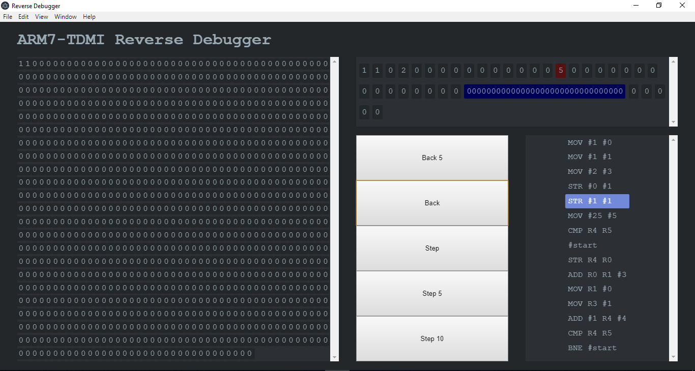

# Project Overview

This project was developed for a University group project module, it aimed to emulate the ARM7TDMI processor and its instruction set in C++. We later added a reversible debugger built in JS so users could step through their custom assembly instructions both forwards and backwards and observe the state of memory and registers.

