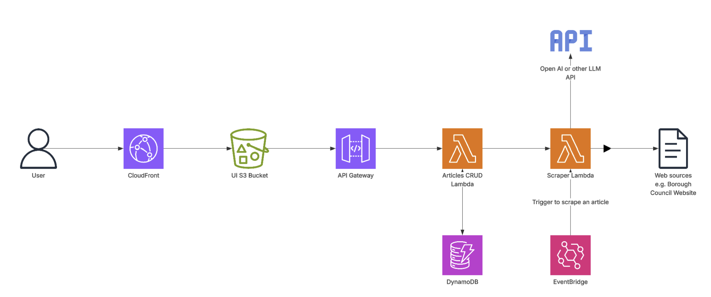

# Project Overview

The [erewash-rag.co.uk](https://erewash-rag.co.uk/) is a joke satirical news site that creates articles about local news where I live in Erewash. It's a distributed system with a few microservices that:
 1. Scrape *real* news sites for source articles
 2. Generate text and images based on those source articles
 3. Make the generated content available to the UI through a REST API

As well as having the direct benefit of annoying my friend who is a Borough Councilor, this project presented a great opportunity to play around with LLMs and more generally to build and deploy a solution in AWS with a web UI.

### Architecture

The design centres around a CRUD REST API exposed with API Gateway. Calls to the endpoints are handled by a Python 'Articles' Lambda that can create/read/update/delete the Articles from DynamoDB. 

For the UI I used React to create a handful of reusable components to nicely display the article content, including the title, author, images etc. that are retrieved from the API.

Finally, population of the articles is done through a Python web scraping lambda. This used Beautiful Soup to parse the article and try and draw out keywords and information to pass into the LLM. Accuracy here is not particularly essential as the LLM tends to hallucinate and add nonsense details to the finished article regardless of the quality of the input however I found it made the articles funnier if it included names of real people/places from the original source.
The web scraper Lambda is currently just triggered manually and needs a source URL to be passed to it. An improvement would definetly be to have it run automatically, probably using some sort of daily/hourly schedule to scrape from some pre-defined locations.

### Tools & Technologies

I've built some similar CRUD APIs in the past, new additions in this project were:
 - Cloudfront for faster UI loading and https
 - A mulit-repo setup with seperate UI, API and Infra repos all deployed using Github actions for CI/CD
 - Terraform for the IaC