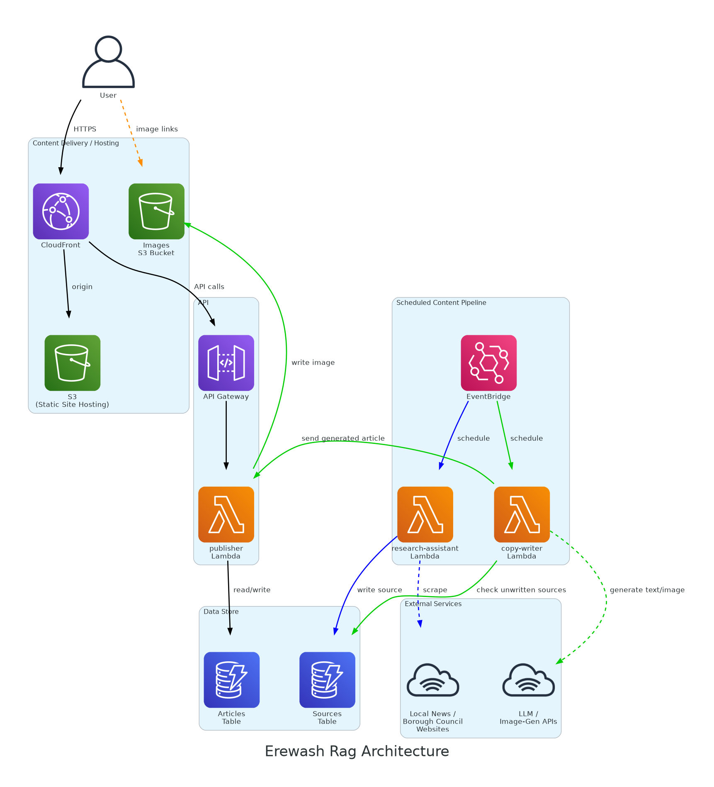

# Project Overview

The [erewash-rag.co.uk](https://erewash-rag.co.uk/) is a joke satirical news site that creates articles about local news where I live in Erewash. It's a distributed system with a few microservices that:
 1. Scrape *real* news sites for source articles
 2. Generate text and images based on those source articles
 3. Make the generated content available to the UI through a REST API

As well as having the direct benefit of annoying my friend who is a Borough Councilor, this project presented a great opportunity to play around with LLMs and more generally to build and deploy a solution in AWS with a web UI.

### Architecture

For this project I wanted to make use of three microservices to differentiate and limit responsibility:
 - The "Research-Assistant" service is the web scraper element, it is triggered on a configurable (but currently twice daily) schedule to scrape articles from a list of pre-configured source sites e.g. the Council's website and a local news site. The scraped info is cleaned up and added to a Sources DynamoDB table for later use
  - The "Copy-Writer" service again triggers twice daily after the research-assistant and checks the Sources DB table for new items. If there are new items, it generates articles about these by making a call to an external API for an LLM and creates an article image by calling a different API for an AI image generation service using the generated article's title as the prompt. Articles are sent to the "Publisher" service and if persisted Copy-Writer will send the image to an S3 bucket.
  - The "Publisher" service acts as a CRUD service for the articles, Articles generated by Copy-Writer are saved by Publisher if they are acceptable, but Publisher also handles requests from the UI coming via the API Gateway

### Development Process

Unlike other solo developer projects I've done which were monolithic I decided to pursue a microservice architecture in this case because there seemed clear separation of responsibility on what each service would do based on how a real news room might work. For the names of the services I even chose real roles from a newsroom to make it clearer within the domain what each services does.

As well as being deployed separately I also decided to break these services into their own Repositories. This presented some challenges with CI/CD as there were cross repo dependencies e.g. you can't deploy the UI if the infra to deploy to doesn't exist yet! However I was helped by building images for each service and pushing them to a registry for later use. That way I could easily select what was being deployed and allow me to get the right building blocks in place.

From a solo developer perspective the resulting architecture is undoubtedly more complicated than this project actually needs. However, I think it represents a reasonable architecture for the sort of system I was aiming for: inexpensive to run when there is little or no traffic, but capable of scaling without requiring a fundamental redesign if the Rag ever did become popular. Since I don't realistically expect it to have a large user base, keeping the running costs close to zero was more important than optimising for high throughput, while the use of independently deployed services gave me the opportunity to experiment with how a more scalable system could be structured.

For the infrastructure in this project I also experimented with Terraform, having normally used AWS CloudFormation for infrastructure-as-code. The main motivation here was simply to gain some practical experience with Terraform and compare it with an approach I was already familiar with. I can't say I necessarily preferred it to CloudFormation, but using it gave me useful experience with another widely-used infrastructure-as-code tool and the challenges of managing infrastructure in a project made up of independently deployed services.