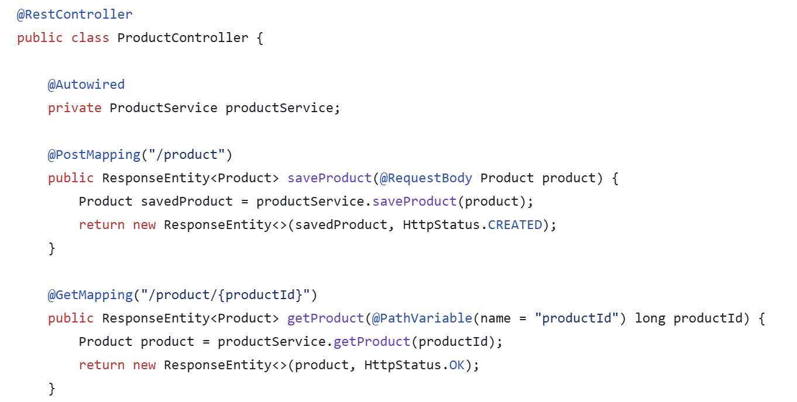

# The Project Overview

This was a small project primarily built for my own benefit, with the aim of creating a reusable template repository that I could use as a starting point for quickly spinning up CRUD-based REST APIs. Rather than building a specific application, the focus was on establishing a sensible baseline structure and development workflow that could be adapted to future projects.

A particular priority was making the project quick and straightforward to test locally. I used Docker to provide a consistent development environment, with containers for Tomcat, MySQL and Flyway handling the application server, database and database migrations respectively. This meant the entire stack could be brought up without requiring developers to manually install and configure each dependency.

The project also gave me an opportunity to experiment with how much infrastructure and configuration is worth including in a reusable template. The result is intentionally more of a practical starting point than a complete framework, providing common pieces such as database configuration, migrations, REST endpoints and local development infrastructure while leaving the application-specific functionality to be added for each new project.

[Github Repository](https://github.com/MickleByte/java-crud-template)