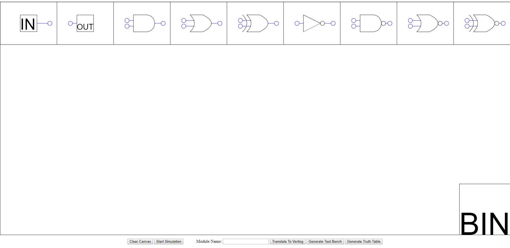
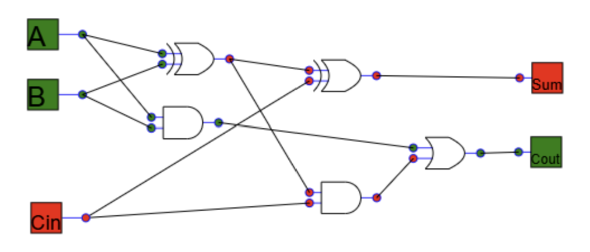

# Project Overview

Created as a part of my final year dissertation, this web app allows users to draw logic diagrams by dragging and dropping components. Diagrams can then be simulated to test their functionality and can also be automatically converted to Verilog HDL. As well as the Verilog code for the module, the app can also generate a test bench. The project is open source and can be used under the GNU General Public License.

