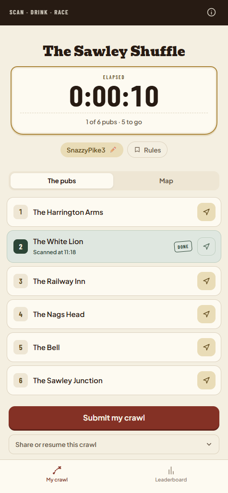
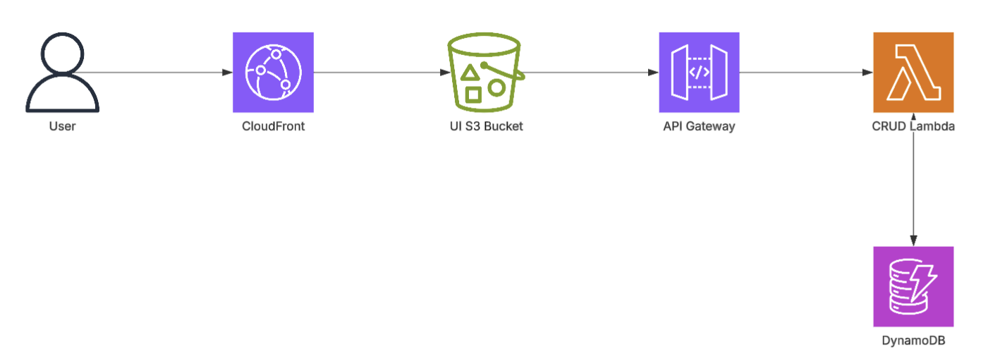
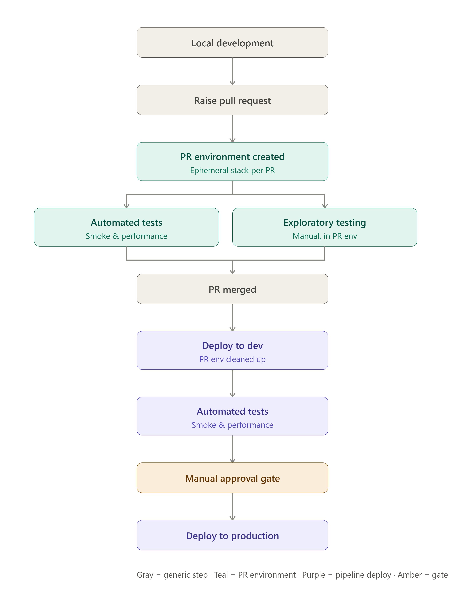

# Project Overview

The idea behind this project came, as many good ideas do, while on a pub crawl with some friends. I thought it would be fun to be able to track your pub crawl and better yet, to have a leaderboard of who completed the pub crawl the fastest/visted the most pubs.

QR codes are an easy way for people in the pub to register a vist and I decided giving each pub a unique ID which could be appended to the base URL will not only load the web page but tell the UI what pub you are in e.g. "pub-crawl.co.uk?pubId=" + "12345". 

Using this and a session Id in local storage it is possible to non-invasively track the user on their crawl and record what pubs they visit and when.

I've later added the leaderboard, a map on the UI as well as navigation links to each pub e.g. to open in Google or Apple maps. I also implemented a system to allow users to get a 'share code'. This means multiple people can either join the same crawl (using the same code) or a user can resume a crawl later should their session be removed from local storage for whatever reason.

Take a look at the dev site at a leaderboard for the dev site at: https://dev.scan-drink-race.com/crawls/the-sawley-shuffle

My primary aim was to make this app scalable in terms of architecture as well as in scope of what pubs are visitable. For that reason, each pub has it's own unique ID and a single pub can feature on any number of crawls. I also chose to make it optional whether users might want to visit a pub so the leaderboard for a crawl is sorted by the number of pubs visited first, then by time.

At this time my local pub crawl 'The Sawley Shuffle' is the only one aimed to be released however this could be easily extended to many other areas if there were a demand.

# Architecture

The architecture uses all serverless AWS components, this means cost to run for low to no users is zero but it will scale very well should traffic increase. The API is exposed using API gateway and calls are handled by a Python lambda which can read and write to DynamoDB. On the UI the React app is available on an S3 bucket configured for static site hosting.

# CI/CD

Using trunk based development I've itteratively built this project. One key feature of the CI/CD process is using dynamic PR environments. One shared Github Action can be invoked to:
 - Create/Update the AWS Stack using the CloudFormation Template
 - Build and deploy the UI to the S3 Bucket
 - Build and deploy the API to the Lambda

On raising a new PR a fresh deployment following all of these steps is done with a custom stack e.g. pub-crawl-pr-34. Automated smoke tests are then run against this stack to ensure no regressions and it remains available for manual exploratory testing until the PR is either merged or closed (at which point another Action cleans up the env).

