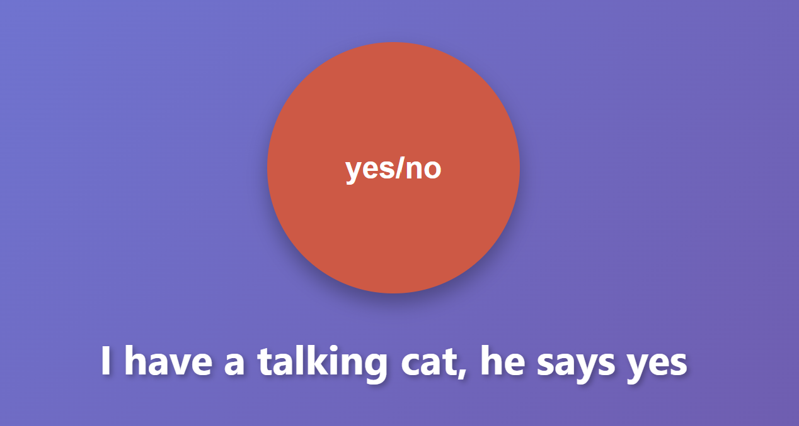

# Project Overview

A super simple project I threw together to help my Girlfriend decide what she wanted for dinner. It has some JS to randomly selects a funny (and possibly insulting) yes or no answer.

The main interesting points here are the use of Github actions as a CI/CD to automatically deploy changes to a S3 bucket configured for static site hosting. This allows me to add new options when the mood strikes and get them quickly deployed.

[See it in action](http://beths-yes-or-no.s3-website.eu-west-2.amazonaws.com/) - *Warning can be rude*

[See it in on Github](https://github.com/MickleByte/beths-yes-or-no)